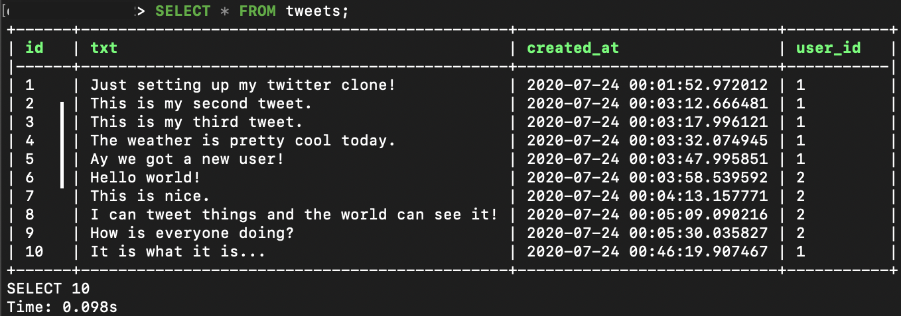
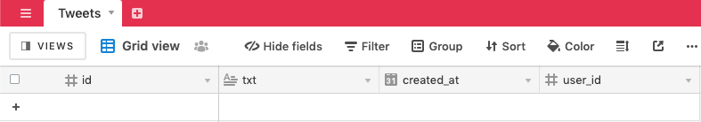
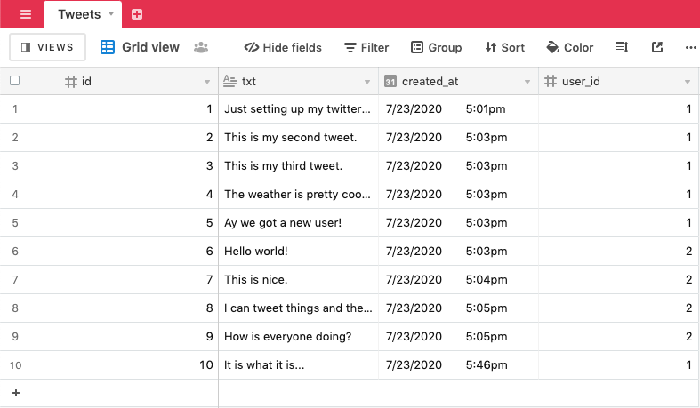

# Postgres to Airtable

## Project Overview

This project contains an example of how to copy rows from a Table in a Postgres Database over to an Airtable Base. It uses the [postgres.db.query](https://autocode.com/stdlib/postgres/db/#query) and [airtable.query.insert](https://autocode.com/stdlib/airtable/query/#insert) APIs from Autocode's Standard Library. You can deploy your own working version of this project in just a few clicks with Autocode.

Click the button above to open this project in Autocode, and make sure you have a Postgres DB with a Table similar to the one in the image below, and create a copy of the sample base on your own Airtable account by clicking this link: https://airtable.com/addBaseFromShare/shrOBs3J6MsVWKkkR. Then, link your Postgres DB and Airtable Base to your project, insert your Base ID in the **airtable.query.insert** endpoint and deploy!

Like all Autocode templates, the endpoints and whatever data you want to copy over and format in both Postgres and Airtable are completely customizable in this project –– everything is code that you can edit and test using the Autocode editor.

## Endpoints

The endpoint is accessible via HTTP. You can make calls to them via the [lib-js](https://github.com/stdlib/lib-js) frontend package, or directly to the URL using `fetch` or any other HTTP client you prefer.

### functions/copy.js

This endpoint will retrieve all the rows from the `tweets` table in the linked Postgres Database, loop through and format them, then send them to Airtable to create records for each in the linked Base.

## Thank You!

Please check out [Autocode](https://autocode.com) or follow us on Twitter, [@AutocodeHQ](https://twitter.com/AutocodeHQ).
